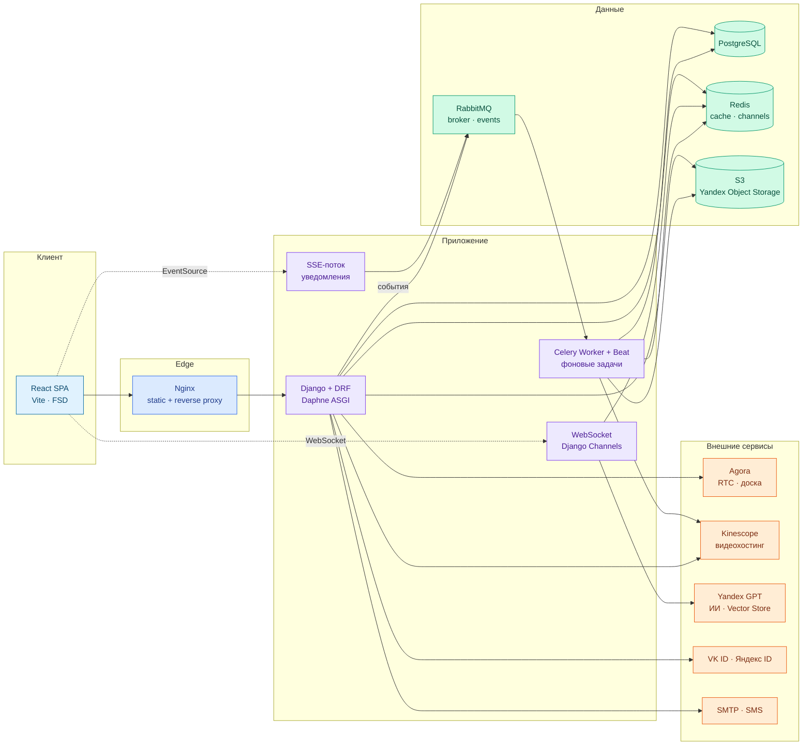
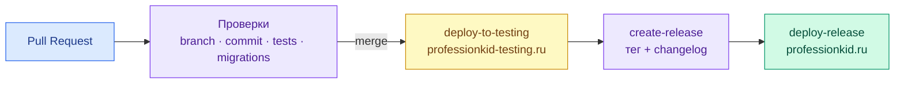

<div align="center">

# Profession Web App

**Образовательная платформа для онлайн-обучения с видеосвязью и ИИ-помощником**

Курсы и уроки · живые вебинары с интерактивной доской · домашние задания с проверкой · ИИ-ассистент по материалам курса · уведомления в реальном времени

**Backend**<br/>
<p align="center">
  
</p>
<p align="center">
  
  
  
  
</p>

**Frontend**<br/>
<p align="center">
  
</p>
<p align="center">
  
  
  
</p>

**Infra**<br/>
<p align="center">
  
</p>
<p align="center">
  
</p>

**Интеграции**<br/>
<p align="center">
  
  
  
  
  
</p>

</div>

---

> Курсовая работа студентов 2 курса ОП «Программная инженерия» ФКН НИУ ВШЭ
> **Щербакова Артёма Юрьевича · Павлычева Семёна Михайловича · Комковой Полины Дмитриевны**
> на тему «Веб-приложение для онлайн-обучения с поддержкой видеосвязи и ИИ-помощника».

**Profession** — полноценная LMS-платформа: преподаватель собирает курс из секций и уроков, проводит живые вебинары с записью и совместной доской, выдаёт домашние задания и проверяет их, а студент учится, задаёт вопросы ИИ-ассистенту, который отвечает по материалам конкретного курса, и получает уведомления о дедлайнах и оценках в реальном времени.

## Содержание

- [Ключевые возможности](#ключевые-возможности)
- [Архитектура системы](#архитектура-системы)
- [Структура монорепозитория](#структура-монорепозитория)
- [Быстрый старт](#быстрый-старт)
- [Сервисы и порты](#сервисы-и-порты)
- [Команды разработки](#команды-разработки)
- [CI/CD и окружения](#cicd-и-окружения)
- [Документация](#документация)
- [Команда](#команда)

---

## Ключевые возможности

| Домен | Возможности |
|-------|-------------|
| **Обучение** | Каталог курсов, иерархия «курс → секция → урок», уроки в формате блочного редактора, превью и публикация |
| **Вебинары** | Живые трансляции (Agora RTC), интерактивная доска (Netless / Fastboard), запись и хостинг на Kinescope |
| **Домашние задания** | Создание заданий, попытки студентов, ручная и автоматическая проверка, оценки и комментарии |
| **ИИ-ассистент** | Чат по материалам курса на Yandex GPT с семантическим поиском (Vector Store), стриминг ответов через WebSocket |
| **Уведомления** | Реальное время через Server-Sent Events + RabbitMQ, дублирование на e-mail/SMS, напоминания о дедлайнах |
| **Расписание** | Календарь занятий и вебинаров, заявки на спецкурсы |
| **Коммерция** | Корзина и оформление покупки курсов, платежи |
| **Аналитика** | Статистика по студентам и курсам, карточки успеваемости |
| **Роли и доступ** | Разграничение прав: **студент**, **преподаватель**, **модератор** (RBAC на бэкенде и фронтенде) |
| **Аутентификация** | JWT, OAuth через **VK ID** и **Яндекс ID**, подтверждение по SMS/e-mail |

---

## Архитектура системы

Монорепозиторий из двух приложений (SPA + API), оркестрируемых через Docker Compose. Бэкенд работает на ASGI (Daphne) и обслуживает REST, WebSocket и SSE одновременно; тяжёлая и периодическая работа вынесена в Celery.



| Слой | Технология | Ответственность |
|------|------------|-----------------|
| Клиент | React SPA | UI, маршрутизация, состояние, real-time клиенты |
| Edge | Nginx | Раздача статики, проксирование `/api`, gzip, security-заголовки |
| API / WS / SSE | Django (Daphne ASGI) | REST, WebSocket-чат, SSE-уведомления, бизнес-логика |
| Очереди | Celery + Beat | Синхронизация Vector Store, обработка вебинаров, рассылки, периодические задачи |
| Данные | PostgreSQL · Redis · RabbitMQ · S3 | Источник истины · кэш и real-time · брокер · файлы |
| Внешние | Agora · Kinescope · Yandex GPT · OAuth · SMTP/SMS | Видео, записи, ИИ, авторизация, коммуникации |

> Детальные схемы — в [README бэкенда](backend/README.md) и [README фронтенда](frontend/README.md).

---

## Структура монорепозитория

```
profession-web-app/
├── backend/                  # Django-проект: REST API, ASGI, Celery, бизнес-логика
│   ├── apps/                 # доменные приложения (users, courses, webinars, ...)
│   ├── project/              # settings, urls, asgi, celery, middleware
│   └── README.md             # ← архитектура и запуск бэкенда
├── frontend/                 # SPA на React + Vite (Feature-Sliced Design)
│   ├── src/                  # app · pages · widgets · features · entities · shared
│   ├── nginx.conf            # конфиг раздачи и проксирования в проде
│   └── README.md             # ← архитектура и запуск фронтенда
├── infra/                    # инфраструктурные артефакты
├── .github/workflows/        # CI/CD: тесты, проверки имён, деплой, релизы
├── docker-compose.yml        # оркестрация всех сервисов
├── docker-compose.override.dev.yml  # dev-режим (HMR фронтенда)
└── Makefile                  # команды разработки
```

---

## Быстрый старт

### Требования

- **Docker 24+** и **Docker Compose v2**

### Запуск через Docker

```bash
git clone https://github.com/Top-of-the-Top/profession-web-app
cd profession-web-app

# Конфигурация бэкенда (секреты Django, доступы к S3, ключи OAuth, токены Kinescope/Agora/Yandex GPT)
cp backend/.env.example backend/.env

# Сборка и запуск всего стека
docker compose build
docker compose up -d
```

Применить миграции и собрать статику:

```bash
docker compose run --rm --no-deps backend python manage.py migrate --noinput
docker compose run --rm --no-deps backend python manage.py collectstatic --noinput
```

Создать суперпользователя для доступа в админку:

```bash
docker compose exec backend python manage.py createsuperuser
```

### Dev-режим (горячая перезагрузка фронтенда)

```bash
docker compose -f docker-compose.yml -f docker-compose.override.dev.yml --profile prod up
```

Остановить всё:

```bash
docker compose down
```

---

## Сервисы и порты

| Сервис | URL / порт | Назначение |
|--------|-----------|------------|
| Фронтенд (SPA) | http://localhost:3000 | Пользовательский интерфейс |
| Бэкенд / API | http://localhost:9000/api/v1/ | REST API |
| Swagger UI | http://localhost:9000/api/v1/swagger | Интерактивная документация API |
| Django Admin | http://localhost:9000/admin/ | Админ-панель (Unfold) |
| RabbitMQ UI | http://localhost:15672 | Управление брокером (`guest`/`guest`) |
| Flower | http://localhost:15666 | Мониторинг Celery-задач |
| PostgreSQL | `localhost:5432` | База данных |
| Redis | `localhost:6379` | Кэш, channels, результаты Celery |

---

## Команды разработки

В корне есть `Makefile` с обёртками над Docker Compose. Несколько полезных целей:

```bash
make help            # список всех команд
make up              # поднять весь стек в фоне
make up-logs         # поднять стек с выводом логов
make down            # остановить
make rebuild         # пересобрать и перезапустить
make migrate         # применить миграции
make makemigrations  # создать миграции
make createsuperuser # создать суперпользователя
make shell           # Django shell
make test            # тесты бэкенда (APP=apps.courses — конкретное приложение)
make logs-backend    # логи бэкенда
make logs-celery     # логи Celery worker
make clean           # остановить и удалить volumes
```

---

## CI/CD и окружения

Автоматизация на **GitHub Actions** (`.github/workflows/`) — от проверки имени ветки до инкрементального деплоя:



| Workflow | Триггер | Что делает |
|----------|---------|------------|
| `backend-tests` | PR в `develop` | Прогон тестов приложений бэкенда (`CI=1`, SQLite) |
| `migration-tests` | PR | Проверка корректности и обратимости миграций |
| `branch-name-check` | push / PR | Валидация имени ветки (`feature/backend/KAN-123-…`) |
| `commit-name-check` | push / PR | Валидация формата сообщений коммитов |
| `deploy-to-testing` | merge | Деплой на **testing**-сервер с детекцией изменений (build только нужных сервисов) |
| `create-release` | вручную | Создание тега и GitHub Release с changelog |
| `deploy-release` | вручную | Деплой выбранного релиза на боевой сервер |

Деплой инкрементальный: через `paths-filter` пересобираются только изменившиеся образы (backend / frontend), миграции запускаются лишь при изменениях в `migrations/`.

| Окружение | Хост | Назначение |
|-----------|------|------------|
| **Testing** | [professionkid-testing.ru](https://professionkid-testing.ru) | Предпродакшен-проверка |
| **Production** | [professionkid.ru](https://professionkid.ru) | Боевая среда |

---

## Документация

| Документ | Описание |
|----------|----------|
| [backend/README.md](backend/README.md) | Архитектура серверной части, домены, запуск, окружение |
| [frontend/README.md](frontend/README.md) | Архитектура SPA (FSD), слои, real-time, запуск |
| `http://localhost:9000/api/v1/swagger` | Интерактивная OpenAPI-документация API |

---

## Команда

| Участник | Контакт |
|----------|---------|
| **Щербаков Артём Юрьевич** | [aishcherbakov@edu.hse.ru](mailto:aishcherbakov@edu.hse.ru) |
| **Павлычев Семён Михайлович** | [smpavlyhcev@edu.hse.ru](mailto:smpavlyhcev@edu.hse.ru) |
| **Комкова Полина Дмитриевна** | [pdkomkova@edu.hse.ru](mailto:pdkomkova@edu.hse.ru) |

<div align="center">

---

ОП «Программная инженерия» · ФКН НИУ ВШЭ · 2026

</div>
