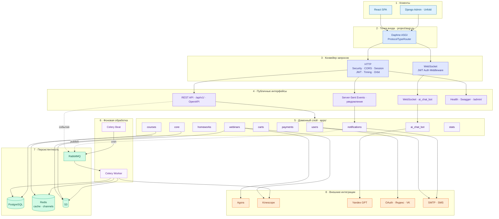
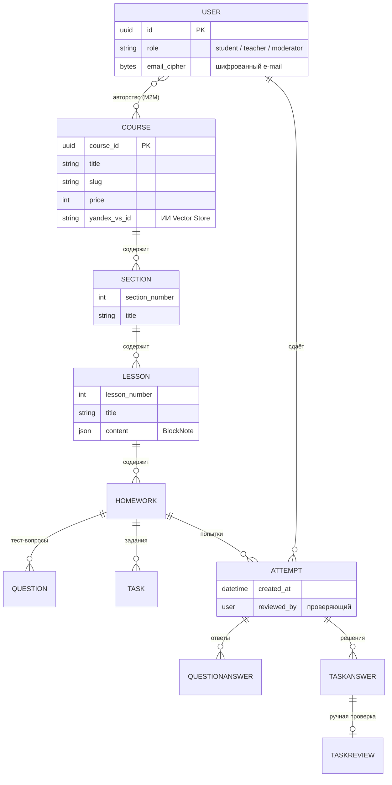
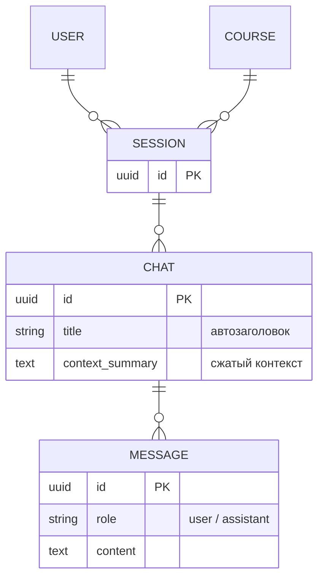
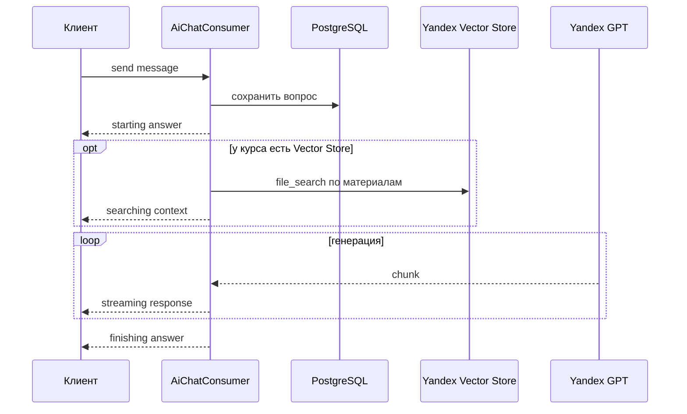
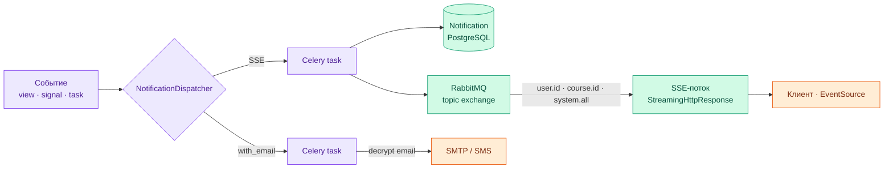
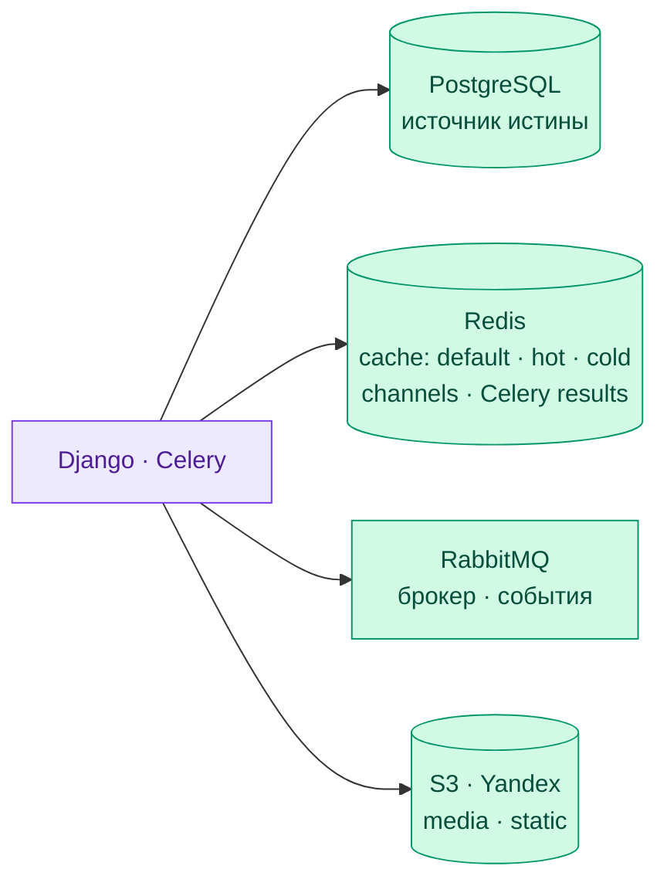
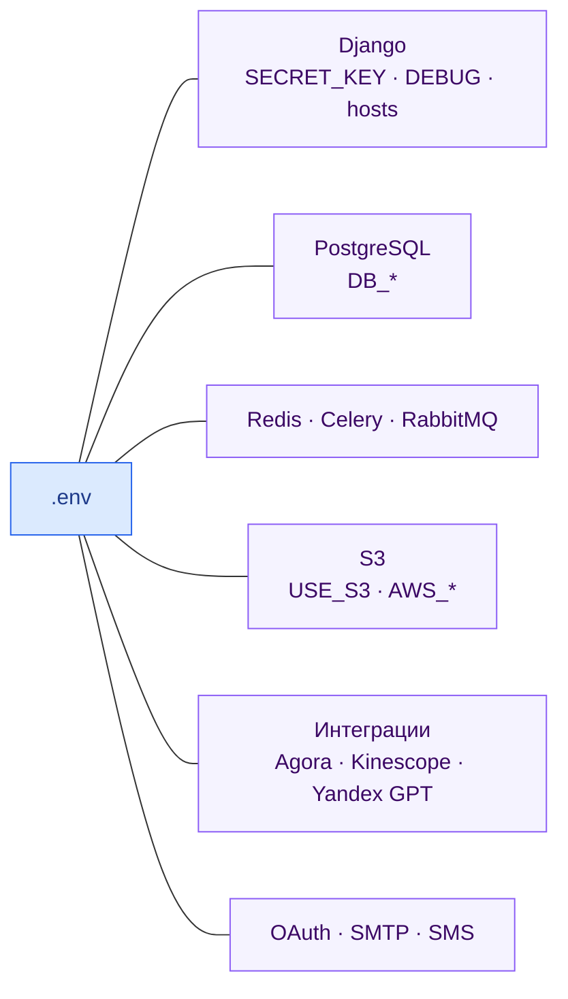

<div align="center">

# Profession Web App — Бэкенд

**Django 6 ASGI-сервер платформы онлайн-обучения**

REST API · WebSocket-чат с ИИ · уведомления в реальном времени · фоновые задачи

<p align="center">
  
</p>

**Ядро**<br/>
<p align="center">
  
  
  
  
</p>

**Очереди и задачи**<br/>
<p align="center">
  
  
</p>

**Данные и хранилище**<br/>
<p align="center">
  
</p>

**Аутентификация и ИИ**<br/>
<p align="center">
  
  
  
  
  
</p>

</div>

> Серверная часть платформы «Profession». Корневой README и Docker Compose — в [корне монорепы](../README.md), клиентская часть — в [frontend/README.md](../frontend/README.md).

---

## Содержание

- [Архитектура](#архитектура)
- [Доменные модули](#доменные-модули)
- [Доменная модель данных](#доменная-модель-данных)
- [Подсистема ИИ-ассистента](#подсистема-ии-ассистента)
- [Подсистема уведомлений](#подсистема-уведомлений)
- [Хранилища данных](#хранилища-данных)
- [API и аутентификация](#api-и-аутентификация)
- [Фоновые задачи](#фоновые-задачи)
- [Запуск](#запуск)
- [Тестирование](#тестирование)
- [Окружение](#окружение)

---

## Архитектура

Единая точка входа — `project/asgi.py`: HTTP-запросы идут через Django, WebSocket — через `project/routing.py`. Бизнес-логика разнесена по доменным приложениям в `apps/`, тяжёлая и периодическая работа — в Celery.



**Конфигурация** — `project/settings.py` · **маршруты** — `project/urls.py` · **Celery** — `project/celery.py`. Каждый домен `apps/<name>/` содержит модели, `api/` (views, serializers, urls) и при необходимости `tasks.py`, `signals.py`, `services/`, `tests/`.

---

## Доменные модули

Двенадцать приложений сгруппированы по зонам ответственности:

```mermaid
mindmap
  root((apps/))
    Доступ
      users · JWT · OAuth · профиль
    Обучение
      courses · секции · уроки
      homeworks · попытки · проверка
      webinars · Agora · Kinescope
      applications · заявки
    Коммерция
      carts · корзина
      payments · платежи
    Платформа
      core · медиа-ассеты · health
      notifications · SSE · рассылки
      ai_chat_bot · WebSocket · ИИ
      admin_panel · API модератора
      stats · аналитика
```



---

## Доменная модель данных

Ядро предметной области — иерархия учебного контента и попыток сдачи ДЗ. Курс ведёт один или несколько авторов (M2M), внутри — секции, уроки, задания; студент сдаёт попытку, которая разбивается на ответы и ручные ревью.



Параллельная ветка — диалоги с ИИ-ассистентом: одна `Session` на пару «пользователь + курс», внутри независимые чаты с историей и сжатым контекстом.



---

## Подсистема ИИ-ассистента

`ai_chat_bot` — ИИ-помощник, отвечающий по материалам конкретного курса. Соединение — WebSocket (`?token=JWT` в query-параметре, т.к. браузер не шлёт заголовки при апгрейде), ответы приходят стримингом по токену.



**Модели** — `Session (user + course) → Chat → Message`. **Vector Store** строится из материалов курса (overview + по файлу на урок) и пересобирается при изменении контента; при его отсутствии бот работает в режиме graceful degradation — отвечает по истории диалога. Длинные диалоги сжимаются компрессором контекста (TextRank), summary хранится в БД для восстановления после переподключения.

---

## Подсистема уведомлений

Доменные события проходят через `NotificationDispatcher`, который по типу события вызывает обработчики: запись в БД + публикация в RabbitMQ (для SSE) и, опционально, отправка e-mail/SMS.



Уведомления бывают трёх типов: **личные** (конкретному пользователю), **курсовые** (всем записавшимся на курс) и **системные** (всем). Клиент держит один SSE-канал и подписывается на свои routing keys; при разрыве переподключается сам. E-mail отправляется параллельно SSE, если событие помечено `with_email`; адрес хранится в зашифрованном виде и расшифровывается перед отправкой.

---

## Хранилища данных



В CI и тестах (`CI=1` или `manage.py test`) внешние зависимости подменяются: PostgreSQL → SQLite, Redis-кэш → `FileBasedCache`, брокер Celery → in-memory с `TASK_ALWAYS_EAGER`. Это позволяет прогонять тесты без поднятого окружения.

---

## API и аутентификация

Все ресурсы — под префиксом `/api/v1/` (модерация, статистика — `/api/v1/statistics/`). Аутентификация — JWT: `Authorization: Bearer <access>`.

| Endpoint | Назначение |
|----------|------------|
| `/api/v1/` | REST-ресурсы доменных приложений |
| `/api/v1/auth/token/refresh/` | Обновление access-токена |
| `/api/v1/swagger` · `/api/v1/schema/` | Swagger UI · OpenAPI-схема |
| `/admin/` | Админ-панель (Unfold) |
| `/health/live/` · `/health/ready/` | Liveness · readiness пробы |

Access-токен живёт 15 минут, refresh — 7 дней с ротацией (`SIMPLE_JWT`). Роли пользователя: **student**, **teacher**, **moderator**.

---

## Фоновые задачи

Celery Beat ставит периодические задачи в RabbitMQ, Worker их исполняет:

```
check-idle-webinars        каждые 60с    — закрытие «зависших» эфиров
assets-poll-s3-events      каждые 30с    — обработка событий загрузки в S3
assets-sweep-pending       каждые 10мин  — очистка незавершённых ассетов
assets-sweep-orphaned      каждый час    — удаление осиротевших файлов
```

Мониторинг задач — **Flower** (`http://localhost:15666`).

---

## Запуск

**Через Docker** (рекомендуется) — из корня монорепы, см. [README](../README.md):

```bash
docker compose up --build
```

**Локально:**

```bash
python -m venv .venv && source .venv/bin/activate
pip install -r requirements.txt
cp .env.example .env

# поднять инфраструктуру
docker compose -f ../docker-compose.yml up redis rabbitmq -d

python manage.py migrate
daphne -b 0.0.0.0 -p 9000 project.asgi:application
```

Celery — отдельными процессами:

```bash
celery -A project worker -l info
celery -A project beat -l info
```

После запуска: API — http://localhost:9000/api/v1/ · Swagger — `/api/v1/swagger` · Admin — `/admin/`.

---

## Тестирование

```bash
# все тесты приложения (SQLite, eager Celery)
CI=1 python manage.py test apps

# конкретное приложение
python manage.py test apps.notifications -v 2
```

Из корня доступны обёртки `make test` (с параметром `APP=apps.<name>`) и сценарные цели вроде `make test-notifications-pipeline`. В CI тесты прогоняются на каждый PR (`.github/workflows/backend-tests.yml`), миграции проверяются отдельным workflow.

---

## Окружение

Конфигурация — через `.env` (см. [`.env.example`](.env.example)):



Полный список переменных с пояснениями — в [`.env.example`](.env.example).
