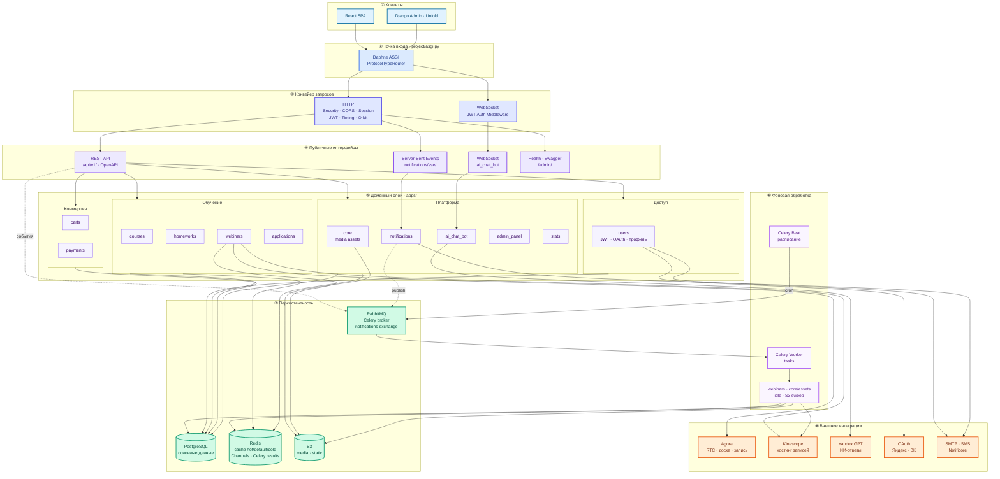

# Серверная часть приложения Profession Web App

Django 6 API для платформы «Профессия»: REST, JWT, WebSocket (ИИ-чат), фоновые задачи Celery, админка Unfold.

Корневой README и Docker Compose — в [корне монорепы](../README.md).

---

## Стек технологий

<p align="center">
  
</p>
<p align="center">
  
  
  
  
  
  
  
  
  
</p>

| Слой | Пакеты |
|------|--------|
| HTTP / WS | Daphne, Django Channels, `channels-redis` |
| API | Django REST Framework, `drf-spectacular` |
| Auth | `rest_framework_simplejwt`, OAuth (Яндекс, ВК) |
| Очереди | Celery, RabbitMQ, Redis (results) |
| Файлы | `django-storages`, S3 (Yandex Object Storage) |
| Admin | `django-unfold` |
| Dev | `django-orbit` (профилирование при `DEBUG=True`) |

---

## Архитектура серверной части



| Слой | Что происходит |
|------|----------------|
| ① Клиенты | SPA ходит в API/SSE/WS; админка — в `/admin/` |
| ② ASGI | `Daphne` маршрутизирует HTTP и WebSocket |
| ③ Конвейер | HTTP: JWT и middleware; WS: проверка токена |
| ④ Интерфейсы | REST, поток уведомлений, чат, служебные URL |
| ⑤ `apps/` | Бизнес-логика и ORM; группы по доменам |
| ⑥ Celery | Beat ставит задачи в RabbitMQ, Worker исполняет |
| ⑦ Данные | PG — источник истины; Redis — кэш и real-time; S3 — файлы |
| ⑧ Интеграции | Видео, записи, ИИ, OAuth, почта и SMS |

**Точка входа** — `project/asgi.py`: HTTP через Django, WebSocket через `project/routing.py` (сейчас — `ai_chat_bot`).

**Конфигурация** — `project/settings.py`, маршруты — `project/urls.py`, Celery — `project/celery.py`.

**Доменные модули** — `apps/<name>/`: модели, `api/` (views, serializers, urls), при необходимости `tasks.py`, `signals.py`, `tests/`.

| Приложение | Назначение |
|------------|------------|
| `users` | Регистрация, JWT, профиль, OAuth |
| `courses` | Курсы, секции, уроки, каталог |
| `webinars` | Эфиры, Agora, записи, Kinescope |
| `homeworks` | Попытки, ответы, проверка |
| `carts` | Корзина |
| `payments` | Платежи |
| `applications` | Заявки на спецкурсы |
| `notifications` | Уведомления, SSE |
| `ai_chat_bot` | ИИ-чат, WebSocket |
| `admin_panel` | API модератора |
| `stats` | Аналитика (`/api/v1/statistics/`) |
| `core` | Медиа-ассеты, health, общие API |

**Кэш Redis** (не CI): `default`, `hot`, `cold` — разные TTL в `CACHES`.

**Периодические задачи** (`CELERY_BEAT_SCHEDULE`): idle-вебинары, опрос S3-событий ассетов, sweep pending/orphaned.

---

## Базы данных

| Хранилище | Когда | Назначение |
|-----------|--------|------------|
| **PostgreSQL** | prod / dev | Основные данные (`DB_*` в `.env`) |
| **SQLite** | `CI=1` или `manage.py test` | Тесты без внешней БД |
| **Redis** | prod / dev | Кэш, Celery results, channel layers |
| **FileBasedCache** | тесты | Замена Redis в CI |
| **S3** | `USE_S3=True` | Медиа и staticfiles |
| **Локальный диск** | `USE_S3=False`, `DEBUG` | `/media/`, `/static/` |

Миграции:

```bash
python manage.py migrate
python manage.py makemigrations <app>
```

---

## Структура каталога

```
backend/
├── apps/              # доменные Django-приложения
├── project/           # settings, urls, asgi, celery, middleware
├── templates/
├── manage.py
├── requirements.txt
├── Dockerfile
└── .env.example
```

---

## Запуск

**Docker** (из корня монорепы, см. [README](../README.md)):

`docker compose up --build`

**Локально:**

```bash
python -m venv .venv && source .venv/bin/activate
pip install -r requirements.txt
cp .env.example .env

docker compose -f ../docker-compose.yml up redis rabbitmq -d

python manage.py migrate
daphne -b 0.0.0.0 -p 9000 project.asgi:application
```

Celery (отдельные процессы):

```bash
celery -A project worker -l info
celery -A project beat -l info
```

| Endpoint | URL |
|----------|-----|
| API | http://localhost:9000/api/v1/ |
| Swagger | http://localhost:9000/api/v1/swagger |
| OpenAPI schema | http://localhost:9000/api/v1/schema/ |
| Admin | http://localhost:9000/admin/ |
| Health | `/health/live/`, `/health/ready/` |

Авторизация: `Authorization: Bearer <access>`, refresh — `POST /api/v1/auth/token/refresh/`.

---

## Окружение

```bash
cp .env.example .env
```

Ключевые группы переменных: Django (`SECRET_KEY`, `DEBUG`), PostgreSQL, Redis/Celery/RabbitMQ, S3, Agora, Kinescope, Yandex GPT, OAuth, почта/SMS. Полный список — в [.env.example](.env.example).

