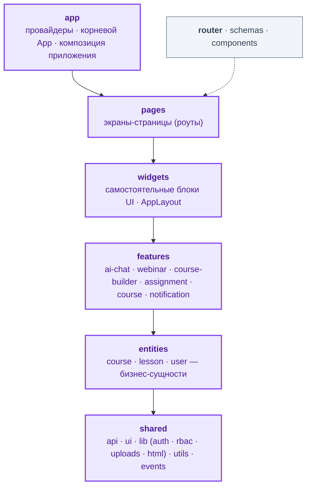
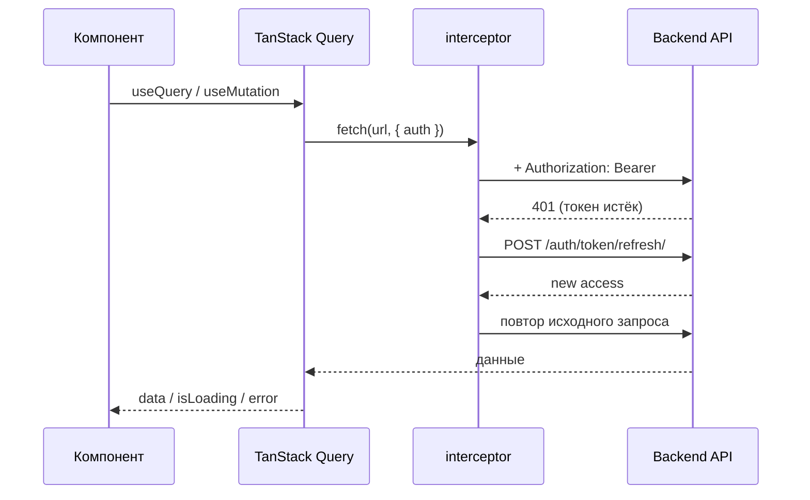
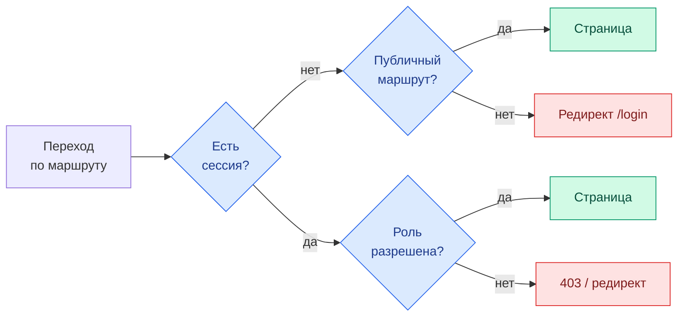
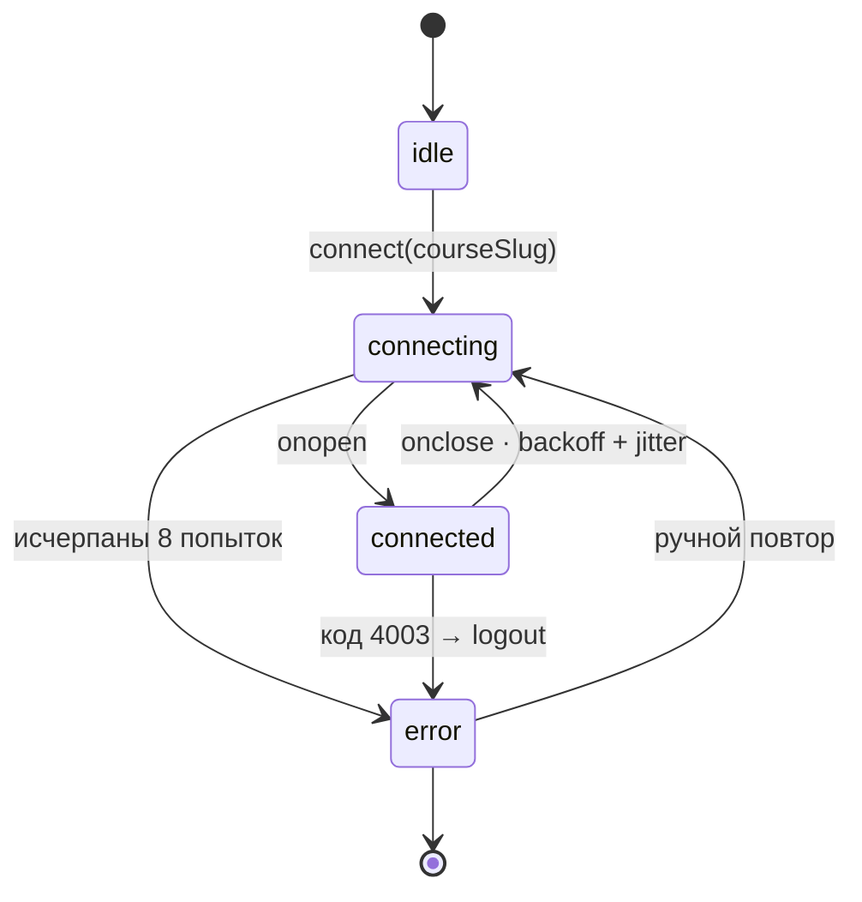

<div align="center">

# Profession Web App — Фронтенд

**Single-Page Application образовательной платформы**

React 19 · TypeScript · Vite · Feature-Sliced Design

<p align="center">
  
</p>

**Ядро**<br/>
<p align="center">
  
</p>

**Состояние и данные**<br/>
<p align="center">
  
  
  
  
</p>

**UI и стили**<br/>
<p align="center">
  
  
  
</p>

**Медиа и интеграции**<br/>
<p align="center">
  
  
  
  
  
</p>

**Качество кода**<br/>
<p align="center">
  
  
</p>

</div>

> Клиентская часть платформы «Profession». Корневой README и Docker Compose — в [корне монорепы](../README.md), серверная часть — в [backend/README.md](../backend/README.md).

---

## Содержание

- [Архитектура · Feature-Sliced Design](#архитектура--feature-sliced-design)
- [Структура каталога](#структура-каталога)
- [Слой данных и API](#слой-данных-и-api)
- [Состояние приложения](#состояние-приложения)
- [Real-time: WebSocket и SSE](#real-time-websocket-и-sse)
- [UI и стилизация](#ui-и-стилизация)
- [Запуск и разработка](#запуск-и-разработка)
- [Скрипты](#скрипты)
- [Переменные окружения](#переменные-окружения)
- [Сборка и деплой](#сборка-и-деплой)

---

## Архитектура · Feature-Sliced Design

Проект построен по методологии **[Feature-Sliced Design](https://feature-sliced.design/)**: код разбит на слои с однонаправленными зависимостями — слой может импортировать только из слоёв ниже. Это удерживает связность модулей и предотвращает циклические зависимости по мере роста.



| Слой | Назначение | Примеры из проекта |
|------|------------|--------------------|
| **`app`** | Инициализация: провайдеры (`QueryClientProvider`), корневой `App`, глобальные стили | `app/App.tsx`, `main.tsx` |
| **`pages`** | Экраны, привязанные к маршрутам; собираются из widgets и features | `home`, `courseLessons`, `webinar`, `statistics`, `profile`, `login` … (30+ страниц) |
| **`widgets`** | Крупные самодостаточные блоки интерфейса | `AppLayout` |
| **`features`** | Пользовательские сценарии с собственной логикой и состоянием | `ai-chat`, `webinar`, `course-builder`, `assignment`, `course`, `notification` |
| **`entities`** | Бизнес-сущности: модели и базовый UI | `course`, `lesson`, `user` |
| **`shared`** | Переиспользуемое ядро без доменной привязки | `api`, `ui`, `lib`, `utils`, `events` |

Вспомогательные верхнеуровневые модули: **`router`** (конфигурация маршрутов и guard-компоненты), **`schemas`** (Zod-схемы форм), **`components`** (shadcn-совместимые компоненты, см. `components.json`).

---

## Структура каталога

```
frontend/
├── public/                    # статика, логотипы, постеры
├── src/
│   ├── app/                   # провайдеры, корневой App
│   ├── pages/                 # экраны-маршруты (lazy)
│   ├── widgets/               # AppLayout и др.
│   ├── features/              # ai-chat · webinar · course-builder · assignment · ...
│   ├── entities/              # course · lesson · user
│   ├── shared/
│   │   ├── api/               # клиенты, queries/mutations, interceptor, queryClient
│   │   ├── ui/                # UI-кит (Button, Dialog, Table, RichTextEditor, ...)
│   │   ├── lib/               # auth · rbac · uploads · html · sileo · api
│   │   ├── utils/             # formSchemas, validation
│   │   └── events/            # глобальные события (authEvents)
│   ├── router/                # routes, ProtectedRoute, PublicRoute, lazyPages
│   ├── schemas/               # Zod-схемы (auth, ...)
│   └── main.tsx               # точка входа
├── globals.css                # глобальные стили и дизайн-токены
├── sileo-tokens.css           # токены дизайн-системы
├── nginx.conf                 # прод-раздача + проксирование /api
├── vite.config.ts             # алиасы, dev-proxy, сборка
├── Dockerfile · Dockerfile.dev
└── components.json            # конфигурация shadcn-генерации
```

---

## Слой данных и API

Работа с сервером сосредоточена в `shared/api`:

- **`queryClient.ts`** — преднастроенный `QueryClient` (TanStack Query).
- **`interceptor.ts`** — единая точка HTTP-запросов: подставляет `Authorization: Bearer <access>`, при `401` выполняет refresh-токена и повторяет запрос, при невосстановимой ошибке диспатчит событие `logout` (`shared/events/authEvents`).
- **Доменные клиенты** — `authApi`, `courseApi`, `cartApi`, `profileApi`, `webinarApi`, `scheduleApi`, `notificationsApi`, `applicationApi`, `landingApi`, `uploadsApi`.
- **`queries/` и `mutations/`** — обёртки `useQuery` / `useMutation` с ключами кэша и инвалидацией.



> В деве запросы идут на относительный `/api`, который Vite проксирует на `http://backend:9000` (`vite.config.ts` → `server.proxy`, с поддержкой WebSocket `ws: true`). В проде проксирование делает Nginx.

---

## Состояние приложения

- **Серверное состояние** — TanStack Query: всё, что приходит с бэкенда (курсы, профиль, расписание), кэшируется и инвалидируется через query-ключи.
- **Клиентское состояние** — Zustand: локальные стораджи фич. Ключевой пример — `useAiChatStore` в `features/ai-chat`: статус соединения, список чатов, история по чату, буфер стриминга и виртуализация старых сообщений.
- **RBAC** — `shared/lib/rbac` (`Can`, `RoleGuard`, `useRole`, `roles.ts`): декларативное разграничение UI по ролям **student / teacher / moderator**.
- **Auth** — `shared/lib/auth` хранит токены и слушает событие `logout` для централизованного выхода.

Доступ к маршрутам контролируют `ProtectedRoute` / `PublicRoute` (`router/`) и RBAC-guard'ы по роли:



---

## Real-time: WebSocket и SSE

Платформа использует два независимых real-time канала.

### ИИ-чат — WebSocket (стриминг)

`features/ai-chat` подключается к `ws://host/api/v1/courses/{slug}/ai/chat/?token={jwt}` (JWT в query-параметре, т.к. браузерный WebSocket не поддерживает заголовки).

- **Singleton-сервис** `AiChatWebSocketService` управляет жизненным циклом одного соединения; `connect()` идемпотентен.
- **Переподключение** — exponential backoff с jitter: `min(500ms · 2^attempt, 8000ms) + rand(0..300ms)`, до 8 попыток; код `4003` (аноним) → выход без реконнекта.
- **Стриминг** — токены приходят чанками (`streaming response`) и накапливаются в `streamBuffer`; во время генерации рендерится отдельный bubble, по `finishing answer` сообщение фиксируется в истории.
- **Виртуализация** — рендерятся только последние ~30 сообщений, старые подгружаются при скролле вверх с сохранением позиции.

Жизненный цикл соединения (`status` в `useAiChatStore`):



### Уведомления — Server-Sent Events

Подписка на `GET /api/notifications/stream/?token=JWT` (`EventSource`): личные, курсовые и системные уведомления приходят в реальном времени; при разрыве клиент переподключается сам.

---

## UI и стилизация

- **Tailwind** (через PostCSS) + утилиты `clsx` и `tailwind-merge` для безопасной композиции классов.
- **CSS Modules** для локальных стилей компонентов (`*.module.css`).
- **Дизайн-токены** `sileo` (`sileo-tokens.css`) и глобальные стили `globals.css`.
- **UI-кит** в `shared/ui` — обёртки над Radix-примитивами в духе shadcn: `Button`, `Dialog`, `Select`, `Table`, `Tabs`, `Tooltip`, `Command`, `RichTextEditor` (Lexical), `Pagination`, `Skeleton` и др. Иконки — `lucide-react`.
- **Новые компоненты** генерируются по конфигурации `components.json` (TypeScript, CSS Modules, `lucide-react`).

---

## Запуск и разработка

### Через Docker (рекомендуется)

Весь стек поднимается из корня монорепы — см. [корневой README](../README.md). Для дев-режима с горячей перезагрузкой используется `Dockerfile.dev` и override-файл.

### Локально

```bash
cd frontend
npm install

cp .env.example .env   # заполнить VITE_API_URL и ключи OAuth

npm run dev            # http://localhost:3000
```

> Dev-сервер проксирует `/api` на `http://backend:9000`. При локальном запуске вне Docker укажите доступный адрес бэкенда (через `VITE_API_URL` и/или правку прокси в `vite.config.ts`).

---

## Скрипты

| Команда | Назначение |
|---------|------------|
| `npm run dev` | Дев-сервер Vite с HMR |
| `npm run build` | Проверка типов (`tsc -b`) и продовая сборка в `dist/` |
| `npm run lint` | ESLint (строго, `--max-warnings 0`) |
| `npm run lint:relaxed` | ESLint без порога предупреждений |
| `npm run format` | Prettier для `src/**/*.{ts,tsx,css,scss}` |
| `npm run type-check` | Проверка типов без эмита |
| `npm run fsd:feature` | Генерация новой FSD-фичи (PowerShell-скрипт) |

---

## Переменные окружения

Файл `.env` (см. [`.env.example`](.env.example)). Все переменные доступны клиенту, поэтому **секреты сюда не кладутся** — только публичные идентификаторы.

| Переменная | Назначение |
|------------|------------|
| `VITE_API_URL` | Базовый URL API (пусто → относительный `/api` через прокси/Nginx) |
| `VITE_YANDEX_CLIENT_ID` | Client ID OAuth Яндекс ID |
| `VITE_YANDEX_REDIRECT_URI` | Redirect URI для Яндекс OAuth |
| `VITE_YANDEX_RESPONSE_TYPE` | Тип ответа OAuth (`code`) |
| `VITE_VK_CLIENT_ID` | Client ID OAuth VK ID |
| `VITE_VK_REDIRECT_URI` | Redirect URI для VK OAuth |
| `VITE_VK_SCOPE` | Запрашиваемые scope VK |

---

## Сборка и деплой

Многоступенчатый `Dockerfile`:

1. **build-стадия** (`node:20-alpine`) — `npm ci`, затем `npm run build` (с увеличенным heap для Node).
2. **runtime-стадия** (`nginx:1.27-alpine`) — статика из `dist/` раздаётся Nginx по конфигу `nginx.conf`.

Nginx в проде:

- раздаёт SPA с fallback на `index.html` (клиентский роутинг);
- проксирует `/api/` на бэкенд (`backend:9000`) с пробросом WebSocket;
- включает gzip, кэширование `assets/` на год, запрет `*.map`;
- ставит security-заголовки: `X-Frame-Options`, `X-Content-Type-Options`, `Referrer-Policy`, `Permissions-Policy`, строгий `Content-Security-Policy`.

```bash
# Самостоятельная сборка прод-образа
docker build -t profession-frontend .
docker run -p 8080:80 profession-frontend
```
