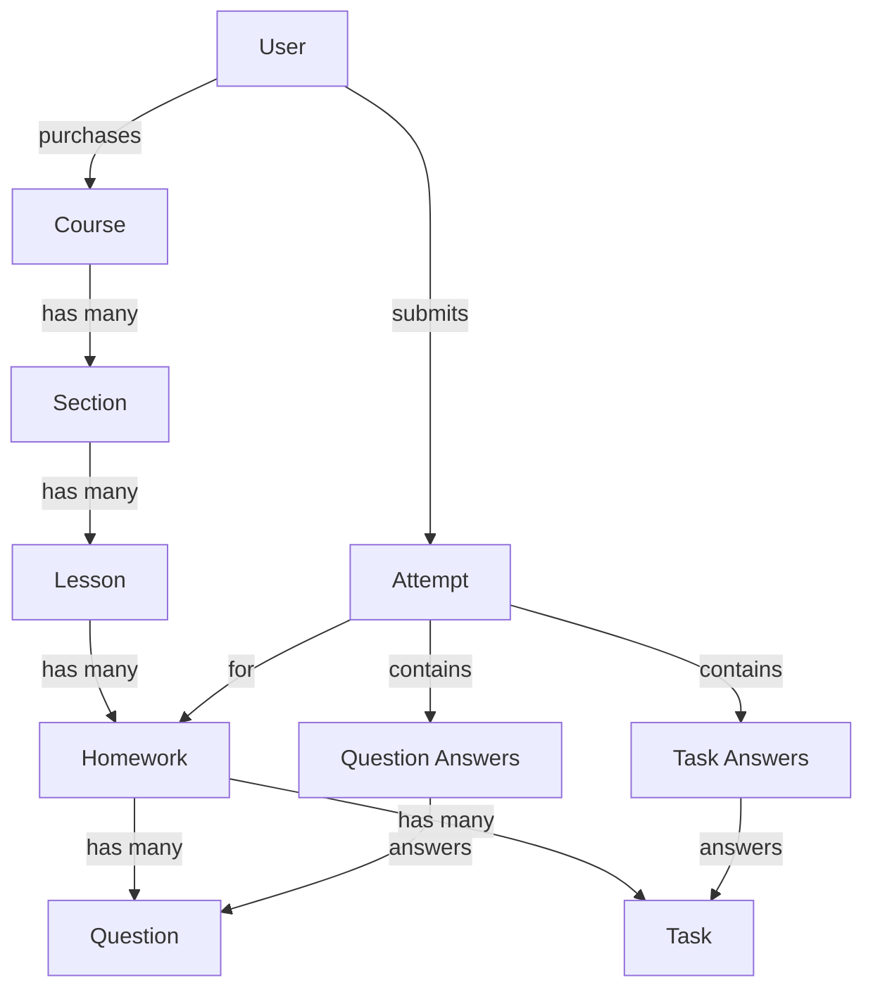

# Courses API Refactoring Plan

## Overview
After the recent changes to the models (migration 0016), the relationship structure has changed:
- **Before**: `Lesson` → `Course` (direct relationship)
- **After**: `Lesson` → `Section` → `Course` (hierarchical relationship)

This requires updates to views, serializers, and URLs to reflect the new structure.

## Issues Identified

### 1. **Serializers Issues** (`backend/apps/courses/api/serializers.py`)
- Lines 62-70: `QuestionSerializer` and `TaskSerializer` incorrectly reference `Homework` model instead of `Question` and `Task`
- Missing: `SectionSerializer` for the new Section model

### 2. **Views Issues** (`backend/apps/courses/api/views.py`)
- Line 7: Missing `Section` import from models
- Line 269: `LessonViewSet.get_queryset()` filters by `course_id__slug` but lessons are now related to sections, not courses directly
- Missing: `SectionViewSet` for CRUD operations on sections
- Missing: Endpoint to list all lessons (without course filter)

### 3. **URLs Issues** (`backend/apps/courses/api/urls.py`)
- Missing: Section CRUD endpoints
- Missing: All-lessons endpoint
- Current lesson routes don't reflect the Section → Lesson hierarchy

### 4. **Model Relationship Issues**
- Line 269 in views.py: `Lesson.objects.filter(course_id__slug=course_slug)` is incorrect
- Should filter by section: `Lesson.objects.filter(section_id__course_id__slug=course_slug)`

## Proposed Changes

### 1. Fix Serializers (`serializers.py`)

```python
# Add Section import
from ..models import Course, PurchasedCourse, Lesson, Homework, Section, Question, Task

# Add SectionSerializer
class SectionSerializer(serializers.ModelSerializer):
    class Meta:
        model = Section
        fields = '__all__'

# Fix QuestionSerializer (line 62-65)
class QuestionSerializer(serializers.ModelSerializer):
    class Meta:
        model = Question  # Changed from Homework
        fields = '__all__'

# Fix TaskSerializer (line 67-70)
class TaskSerializer(serializers.ModelSerializer):
    class Meta:
        model = Task  # Changed from Homework
        fields = '__all__'
```

### 2. Add SectionViewSet (`views.py`)

```python
# Add Section to imports (line 7)
from ..models import Course, PurchasedCourse, Lesson, Task, Homework, Question, Section

# Add Section serializer to imports (line 8-18)
from .serializers import (
    # ... existing imports ...
    SectionSerializer
)

# Add schema constants for Section
SCHEMA_SECTION_404 = {
    "type": "object",
    "properties": {
        "detail": {
            "type": "string",
            "description": "Секция не найдена.",
            "example": "Секция не найдена",
        }
    },
}

SCHEMA_SECTION_500 = {
    "type": "object",
    "properties": {
        "detail": {
            "type": "string",
            "description": "Внутренняя ошибка сервера.",
            "example": "Произошла ошибка при обработке запроса.",
        }
    },
}

# Add SectionViewSet
class SectionViewSet(viewsets.ModelViewSet):
    permission_classes = (IsAuthenticated,)
    http_method_names = ['get', 'post', 'patch', 'delete']
    serializer_class = SectionSerializer
    lookup_field = 'slug'

    def get_queryset(self):
        course_slug = self.kwargs['course_slug']
        return Section.objects.filter(course_id__slug=course_slug)

    @extend_schema(
        summary="Получить список секций курса",
        tags=["Sections"],
        responses={
            200: SectionSerializer(many=True),
            401: {"description": "Не авторизован", "schema": SCHEMA_401},
            500: {"description": "Внутренняя ошибка сервера.", "schema": SCHEMA_SECTION_500},
        }
    )
    def list(self, request, *args, **kwargs):
        return super().list(request, *args, **kwargs)

    @extend_schema(
        summary="Создать новую секцию",
        tags=["Sections"],
        responses={
            201: SectionSerializer,
            401: {"description": "Не авторизован", "schema": SCHEMA_401},
            500: {"description": "Внутренняя ошибка сервера.", "schema": SCHEMA_SECTION_500},
        }
    )
    def create(self, request, *args, **kwargs):
        return super().create(request, *args, **kwargs)

    @extend_schema(
        summary="Получить информацию о секции",
        tags=["Sections"],
        parameters=[
            OpenApiParameter(
                name='slug',
                type=OpenApiTypes.STR,
                location=OpenApiParameter.PATH,
                description='slug секции'),
        ],
        responses={
            200: SectionSerializer,
            401: {"description": "Не авторизован", "schema": SCHEMA_401},
            404: {"description": "Секция не найдена.", "schema": SCHEMA_SECTION_404},
            500: {"description": "Внутренняя ошибка сервера.", "schema": SCHEMA_SECTION_500},
        }
    )
    def retrieve(self, request, *args, **kwargs):
        return super().retrieve(request, *args, **kwargs)

    @extend_schema(
        summary="Обновить секцию",
        tags=["Sections"],
        parameters=[
            OpenApiParameter(
                name='slug',
                type=OpenApiTypes.STR,
                location=OpenApiParameter.PATH,
                description='slug секции'),
        ],
        responses={
            200: SectionSerializer,
            401: {"description": "Не авторизован", "schema": SCHEMA_401},
            404: {"description": "Секция не найдена.", "schema": SCHEMA_SECTION_404},
            500: {"description": "Внутренняя ошибка сервера.", "schema": SCHEMA_SECTION_500},
        }
    )
    def partial_update(self, request, *args, **kwargs):
        return super().partial_update(request, *args, **kwargs)

    @extend_schema(
        summary="Удалить секцию",
        tags=["Sections"],
        parameters=[
            OpenApiParameter(
                name='slug',
                type=OpenApiTypes.STR,
                location=OpenApiParameter.PATH,
                description='slug секции'),
        ],
        responses={
            204: None,
            401: {"description": "Не авторизован", "schema": SCHEMA_401},
            404: {"description": "Секция не найдена.", "schema": SCHEMA_SECTION_404},
            500: {"description": "Внутренняя ошибка сервера.", "schema": SCHEMA_SECTION_500},
        }
    )
    def destroy(self, request, *args, **kwargs):
        return super().destroy(request, *args, **kwargs)
```

### 3. Add LessonListView for All Lessons (`views.py`)

```python
class LessonListView(generics.ListAPIView):
    """Endpoint to list all lessons without course filter"""
    permission_classes = (IsAuthenticated,)
    serializer_class = LessonSerializer
    queryset = Lesson.objects.all()

    @extend_schema(
        summary="Получить список всех уроков",
        tags=["Lessons"],
        responses={
            200: LessonSerializer(many=True),
            401: {"description": "Не авторизован", "schema": SCHEMA_401},
            500: {"description": "Внутренняя ошибка сервера.", "schema": SCHEMA_LESSON_500},
        }
    )
    def get(self, request, *args, **kwargs):
        return super().get(request, *args, **kwargs)
```

### 4. Fix LessonViewSet.get_queryset() (`views.py`)

**Current (line 268-270):**
```python
def get_queryset(self):
    course_slug = self.kwargs['course_slug']
    return Lesson.objects.filter(course_id__slug=course_slug)
```

**Updated:**
```python
def get_queryset(self):
    course_slug = self.kwargs.get('course_slug')
    section_slug = self.kwargs.get('section_slug')

    if section_slug:
        # Filter by section when section_slug is provided
        return Lesson.objects.filter(section_id__slug=section_slug)
    elif course_slug:
        # Filter by course (through section) when only course_slug is provided
        return Lesson.objects.filter(section_id__course_id__slug=course_slug)
    else:
        # Return all lessons if no filters
        return Lesson.objects.all()
```

### 5. Update URLs (`urls.py`)

**New URL structure:**

```python
from django.urls import path
from rest_framework.routers import SimpleRouter
from . import views

app_name = 'courses'

urlpatterns = [
    # Existing course endpoints
    path('landing/courses/', views.CourseDTOList.as_view(),
         name='course-list-preview'),
    path('app/store/', views.CourseDTOListAuthenticated.as_view(),
         name='course-list-store'),
    path('app/courses/<slug:slug>/', views.CourseDetail.as_view(),
         name='course-detail'),
    path('app/my-courses/', views.PurchasedCoursesView.as_view(),
         name='my-courses'),

    # NEW: All lessons endpoint
    path('app/lessons/', views.LessonListView.as_view(),
         name='all-lessons'),
]

router = SimpleRouter()

# Section CRUD (NEW)
router.register(
    r'courses/(?P<course_slug>[^/.]+)/sections',
    views.SectionViewSet,
    basename='course-sections'
)

# Lessons within a section (NEW - proper hierarchy)
router.register(
    r'courses/(?P<course_slug>[^/.]+)/sections/(?P<section_slug>[^/.]+)/lessons',
    views.LessonViewSet,
    basename='section-lessons'
)

# Homeworks within a lesson
router.register(
    r'courses/(?P<course_slug>[^/.]+)/sections/(?P<section_slug>[^/.]+)/lessons/(?P<lesson_slug>[^/.]+)/homeworks',
    views.HomeworkViewSet,
    basename='lesson-homeworks'
)

# Questions within a homework
router.register(
    r'courses/(?P<course_slug>[^/.]+)/sections/(?P<section_slug>[^/.]+)/lessons/(?P<lesson_slug>[^/.]+)/homeworks/(?P<homework_slug>[^/.]+)/questions',
    views.QuestionViewSet,
    basename='homework-questions'
)

# Tasks within a homework
router.register(
    r'courses/(?P<course_slug>[^/.]+)/sections/(?P<section_slug>[^/.]+)/lessons/(?P<lesson_slug>[^/.]+)/homeworks/(?P<homework_slug>[^/.]+)/tasks',
    views.TaskViewSet,
    basename='homework-tasks'
)

urlpatterns += router.urls
```

### 6. Update HomeworkViewSet.get_queryset() (`views.py`)

**Current (line 362-368):**
```python
def get_queryset(self):
    course_slug = self.kwargs['course_slug']
    lesson_slug = self.kwargs['lesson_slug']
    return Homework.objects.filter(
        lesson_id__slug=lesson_slug,
        lesson_id__course_id__slug=course_slug
    )
```

**Updated:**
```python
def get_queryset(self):
    course_slug = self.kwargs['course_slug']
    section_slug = self.kwargs['section_slug']
    lesson_slug = self.kwargs['lesson_slug']
    return Homework.objects.filter(
        lesson_id__slug=lesson_slug,
        lesson_id__section_id__slug=section_slug,
        lesson_id__section_id__course_id__slug=course_slug
    )
```

### 7. Update TaskViewSet.get_queryset() (`views.py`)

**Current (line 460-468):**
```python
def get_queryset(self):
    course_slug = self.kwargs['course_slug']
    lesson_slug = self.kwargs['lesson_slug']
    homework_slug = self.kwargs['homework_slug']
    return Task.objects.filter(
        homework_id__slug=homework_slug,
        homework__id__lesson_id__slug=lesson_slug,
        homework__id__lesson_id__course_id__slug=course_slug
    )
```

**Updated:**
```python
def get_queryset(self):
    course_slug = self.kwargs['course_slug']
    section_slug = self.kwargs['section_slug']
    lesson_slug = self.kwargs['lesson_slug']
    homework_slug = self.kwargs['homework_slug']
    return Task.objects.filter(
        homework_id__slug=homework_slug,
        homework_id__lesson_id__slug=lesson_slug,
        homework_id__lesson_id__section_id__slug=section_slug,
        homework_id__lesson_id__section_id__course_id__slug=course_slug
    )
```

### 8. Update QuestionViewSet.get_queryset() (`views.py`)

**Current (line 560-569):**
```python
def get_queryset(self):
    course_slug = self.kwargs['course_slug']
    lesson_slug = self.kwargs['lesson_slug']
    homework_slug = self.kwargs['homework_slug']

    return Question.objects.filter(
        homework_id__slug=homework_slug,
        homework_id__lesson_id__slug=lesson_slug,
        homework_id__lesson_id__course_id__slug=course_slug
    )
```

**Updated:**
```python
def get_queryset(self):
    course_slug = self.kwargs['course_slug']
    section_slug = self.kwargs['section_slug']
    lesson_slug = self.kwargs['lesson_slug']
    homework_slug = self.kwargs['homework_slug']

    return Question.objects.filter(
        homework_id__slug=homework_slug,
        homework_id__lesson_id__slug=lesson_slug,
        homework_id__lesson_id__section_id__slug=section_slug,
        homework_id__lesson_id__section_id__course_id__slug=course_slug
    )
```

## API Endpoints Summary

### New/Updated Endpoints:

1. **All Lessons** (NEW)
   - `GET /api/courses/app/lessons/` - List all lessons

2. **Sections** (NEW)
   - `GET /api/courses/courses/{course_slug}/sections/` - List sections
   - `POST /api/courses/courses/{course_slug}/sections/` - Create section
   - `GET /api/courses/courses/{course_slug}/sections/{slug}/` - Get section
   - `PATCH /api/courses/courses/{course_slug}/sections/{slug}/` - Update section
   - `DELETE /api/courses/courses/{course_slug}/sections/{slug}/` - Delete section

3. **Lessons** (UPDATED - now under sections)
   - `GET /api/courses/courses/{course_slug}/sections/{section_slug}/lessons/`
   - `POST /api/courses/courses/{course_slug}/sections/{section_slug}/lessons/`
   - `GET /api/courses/courses/{course_slug}/sections/{section_slug}/lessons/{slug}/`
   - `PATCH /api/courses/courses/{course_slug}/sections/{section_slug}/lessons/{slug}/`
   - `DELETE /api/courses/courses/{course_slug}/sections/{section_slug}/lessons/{slug}/`

4. **Homeworks** (UPDATED - path includes section)
   - `GET /api/courses/courses/{course_slug}/sections/{section_slug}/lessons/{lesson_slug}/homeworks/`
   - etc.

5. **Questions & Tasks** (UPDATED - path includes section)
   - Similar pattern with section_slug in path

## Data Flow Diagram



## Implementation Order

1. ✅ Fix serializers (Question, Task, add Section)
2. ✅ Add Section ViewSet with CRUD
3. ✅ Add all-lessons endpoint
4. ✅ Update LessonViewSet.get_queryset()
5. ✅ Update HomeworkViewSet.get_queryset()
6. ✅ Update TaskViewSet.get_queryset()
7. ✅ Update QuestionViewSet.get_queryset()
8. ✅ Update URLs to reflect new hierarchy

## Testing Checklist

After implementation, verify:
- [ ] Section CRUD operations work correctly
- [ ] Sections return only their own lessons
- [ ] All lessons endpoint returns all lessons
- [ ] Lesson filtering by section works
- [ ] Homework filtering includes section in path
- [ ] Question/Task filtering includes section in path
- [ ] API documentation (Swagger/OpenAPI) is correct
- [ ] No broken imports or references
- [ ] All ViewSet querysets use correct model relationships

## Notes

- The Section model auto-increments `section_id` within each course
- When retrieving a section's data, only return lessons belonging to that section
- Maintain backward compatibility where possible
- Ensure proper permission checks on all endpoints
- Consider adding select_related/prefetch_related for performance optimization
